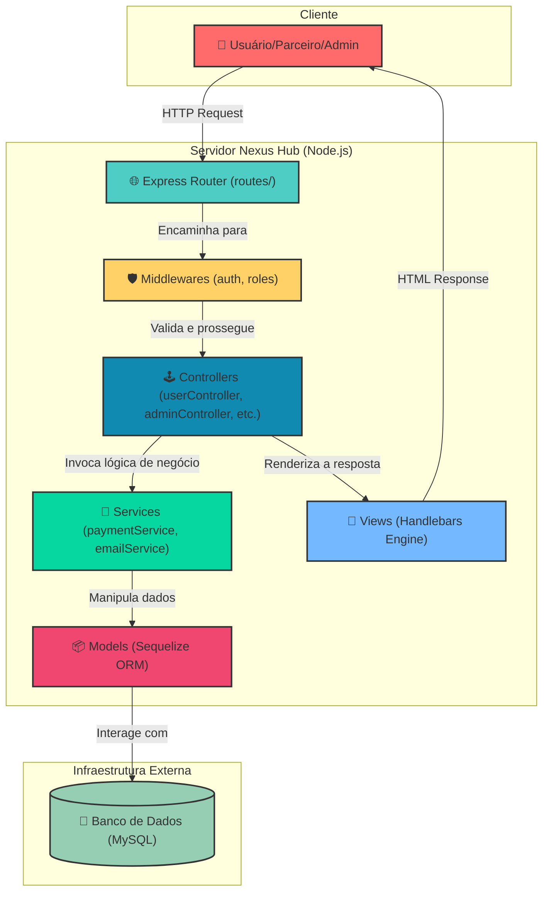

# Nexus Hub: Marketplace de Chaves Digitais de Jogos

*O seu portal central para o universo dos jogos digitais, unificando vendedores e jogadores em uma plataforma robusta e escalável.*

> 📚 **Nota sobre a Documentação:**
> A documentação técnica completa, diagramas adicionais e manuais detalhados deste sistema são mantidos em uma **branch órfã** dedicada.
> Você pode acessar todo o material suplementar navegando para a branch **[`docs`](https://github.com/JobFinder-Project/Nexus-Hub/tree/docs)** neste repositório.

---

## Abstract (Resumo Técnico)

O Nexus Hub emerge como uma solução arquitetônica para o crescente e fragmentado mercado de distribuição de chaves digitais de jogos. O projeto aborda a necessidade de uma plataforma centralizada que sirva como um marketplace, conectando parceiros (vendedores) a consumidores finais de forma segura e organizada. A solução proposta é uma aplicação web monolítica, construída sobre um stack tecnológico robusto e comprovado, compreendendo Node.js com o framework Express.js para o backend, Sequelize como ORM para abstração da camada de dados com um banco de dados MySQL, e Express Handlebars para a renderização de views no lado do servidor (SSR). A metodologia de desenvolvimento segue um padrão arquitetural análogo ao Model-View-Controller (MVC), promovendo uma clara separação de responsabilidades entre a lógica de negócio, a manipulação de dados e a interface do usuário. O sistema é projetado com controle de acesso baseado em papéis (RBAC), definindo perfis distintos para Administradores, Parceiros e Usuários, cada um com dashboards e permissões específicas. A contribuição fundamental do Nexus Hub é fornecer uma base de código estruturada, modular e extensível para a criação de um marketplace digital, governado por uma licença não comercial que incentiva o uso para fins pessoais, educacionais e de pesquisa.

## Badges Abrangentes


## Sumário (Table of Contents)

1.  [Introdução e Motivação](#introdução-e-motivação)
2.  [Arquitetura do Sistema](#arquitetura-do-sistema)
3.  [Decisões de Design Chave](#decisões-de-design-chave)
4.  [✨ Funcionalidades Detalhadas](#-funcionalidades-detalhadas-com-casos-de-uso)
5.  [🛠️ Tech Stack Detalhado](#️-tech-stack-detalhado)
6.  [📂 Estrutura Detalhada do Código-Fonte](#-estrutura-detalhada-do-código-fonte)
7.  [📋 Pré-requisitos Avançados](#-pré-requisitos-avançados)
8.  [🚀 Guia de Instalação e Configuração Avançada](#-guia-de-instalação-e-configuração-avançada)
9.  [⚙️ Uso Avançado e Exemplos](#️-uso-avançado-e-exemplos)
10. [🔧 API Reference](#-api-reference-se-aplicável)
11. [🧪 Estratégia de Testes e Qualidade de Código](#-estratégia-de-testes-e-qualidade-de-código)
12. [🚢 Deployment Detalhado e Escalabilidade](#-deployment-detalhado-e-escalabilidade)
13. [🤝 Contribuição (Nível Avançado)](#-contribuição-nível-avançado)
14. [📜 Licença e Aspectos Legais](#-licença-e-aspectos-legais)
15. [👥 Equipe Principal e Colaboradores Chave](#-equipe-principal-e-colaboradores-chave)
16. [🗺️ Roadmap Detalhado e Visão de Longo Prazo](#️-roadmap-detalhado-e-visão-de-longo-prazo)
17. [❓ FAQ (Perguntas Frequentes)](#-faq-perguntas-frequentes)
18. [📞 Contato e Suporte](#-contato-e-suporte)

## Introdução e Motivação

O mercado global de jogos digitais é um ecossistema vasto e dinâmico, caracterizado por uma multiplicidade de plataformas de distribuição, desenvolvedores e revendedores. Essa fragmentação, embora impulsione a competição, frequentemente resulta em uma experiência de usuário complexa e descentralizada. Os jogadores precisam navegar por diversas lojas para encontrar os melhores preços e títulos, enquanto vendedores menores (parceiros) enfrentam barreiras significativas para alcançar um público mais amplo.

O Nexus Hub foi concebido para mitigar esses desafios. A motivação central do projeto é a criação de um marketplace unificado que sirva como um nexo — um ponto de conexão central — para a compra e venda de chaves de ativação de jogos. A proposta de valor do projeto reside em sua arquitetura aberta e modular, que visa oferecer:

*   **Para os Usuários:** Uma interface intuitiva e centralizada para descobrir, comparar e adquirir jogos de diferentes vendedores, com um histórico de compras unificado.
*   **Para os Parceiros:** Uma plataforma de baixo atrito para listar seu inventário de chaves digitais, gerenciar produtos e alcançar uma base de clientes consolidada, com ferramentas dedicadas em um painel exclusivo.
*   **Para os Administradores:** Um sistema de gerenciamento completo para supervisionar todas as operações do marketplace, incluindo a curadoria de produtos, gestão de usuários e parceiros, e a garantia da integridade da plataforma.

Este projeto não busca apenas ser uma aplicação funcional, mas também um artefato de software bem-estruturado que possa servir como um estudo de caso ou um ponto de partida para o desenvolvimento de sistemas de e-commerce complexos.

## Arquitetura do Sistema

O Nexus Hub adota uma arquitetura monolítica com renderização no lado do servidor (SSR), uma escolha deliberada para otimizar o tempo de desenvolvimento inicial, simplificar o deployment e garantir um bom desempenho de SEO (Search Engine Optimization). A estrutura interna é fortemente influenciada pelo padrão MVC (Model-View-Controller), garantindo uma separação de responsabilidades robusta.



**Descrição dos Componentes:**

*   **Express Router (`routes/`):** Ponto de entrada para todas as requisições HTTP. Mapeia as URLs para os controllers correspondentes, organizando os endpoints de forma semântica (ex: `/admin`, `/user`, `/catalog`).
*   **Middlewares (`middlewares/`):** Funções que interceptam o ciclo de requisição-resposta. Utilizados para tarefas transversais como autenticação (`authMiddleware.js`), verificação de permissões baseadas em papéis (`roleMiddleware.js`), logging e tratamento de erros.
*   **Controllers (`controllers/`):** Orquestram o fluxo de dados. Recebem as requisições, validam os inputs, invocam os serviços apropriados para executar a lógica de negócio e, por fim, determinam qual view será renderizada com quais dados.
*   **Services (`services/`):** Camada opcional que encapsula a lógica de negócio principal e complexa, como processamento de pagamentos ou envio de e-mails. Isso mantém os controllers mais enxutos e focados na gestão do fluxo HTTP.
*   **Models (`models/`):** Define a estrutura dos dados da aplicação utilizando o Sequelize ORM. Cada modelo (ex: `User.js`, `Product.js`) representa uma tabela no banco de dados e abstrai as operações de CRUD (Create, Read, Update, Delete).
*   **Views (`views/`):** Camada de apresentação, composta por templates Handlebars. Responsável por renderizar a interface do usuário (HTML) dinamicamente, preenchendo os templates com os dados fornecidos pelos controllers.
*   **Banco de Dados (MySQL):** Sistema de gerenciamento de banco de dados relacional que persiste todos os dados da aplicação, como usuários, produtos, chaves e compras.

## Decisões de Design Chave

*   **Node.js e Express.js:** A escolha do ecossistema Node.js foi motivada por sua natureza assíncrona e orientada a eventos, ideal para aplicações web I/O-bound. Express.js foi selecionado como o framework web por ser minimalista, flexível e possuir um vasto ecossistema de middlewares, permitindo a construção de uma aplicação robusta de forma ágil.
*   **Sequelize ORM:** Para a camada de acesso a dados, um ORM como o Sequelize foi preferido em vez de SQL bruto para aumentar a produtividade do desenvolvedor, reduzir a probabilidade de erros de SQL (como injeção) e fornecer uma abstração que torna o código mais legível e portável entre diferentes bancos de dados SQL.
*   **MySQL:** Selecionado por ser o banco de dados relacional open-source mais popular do mundo, oferecendo excelente performance para aplicações web, robustez e alta compatibilidade com provedores de hospedagem.
*   **Renderização no Lado do Servidor (SSR) com Handlebars:** Em contraste com uma arquitetura SPA (Single Page Application), o SSR foi escolhido para simplificar a complexidade inicial do frontend, melhorar o SEO e garantir um Time-to-Content mais rápido para o usuário. Handlebars é um motor de templates lógico e simples, adequado para este propósito.
*   **Estrutura de Diretórios Modular:** A organização do código-fonte em diretórios como `controllers`, `models`, `routes`, `services` e `middlewares` impõe uma separação de interesses clara, facilitando a manutenção, o teste e a escalabilidade do projeto à medida que novas funcionalidades são adicionadas.

## ✨ Funcionalidades Detalhadas (com Casos de Uso)

*   **Gestão de Autenticação e Perfis de Usuário**
    *   **Descrição:** Sistema completo para registro, login e gerenciamento de sessões de usuários. Cada usuário possui um perfil e um histórico de compras.
    *   **Caso de Uso:** Um novo visitante se cadastra na plataforma. Após confirmar seu e-mail, ele pode fazer login para acessar seu painel, visualizar seu histórico de compras e gerenciar suas informações pessoais.

*   **Catálogo de Produtos Dinâmico**
    *   **Descrição:** Exibição de todos os jogos disponíveis para venda. A funcionalidade deve incluir busca, filtros (por gênero, plataforma, preço) e uma página de detalhes para cada produto.
    *   **Caso de Uso:** Um usuário navega até o catálogo, utiliza a barra de busca para encontrar "Cyberpunk 2077" e clica no resultado para ver detalhes como descrição, preço, requisitos de sistema e chaves disponíveis.

*   **Painel de Administração Centralizado**
    *   **Descrição:** Uma área restrita para administradores com controle total sobre a plataforma. Inclui gerenciamento de usuários, aprovação de parceiros, curadoria de produtos e visualização de métricas de vendas.
    *   **Caso de Uso:** Um administrador recebe uma notificação de um novo parceiro solicitando cadastro. Ele revisa as informações do parceiro e, se estiverem corretas, aprova o cadastro, permitindo que o parceiro comece a vender na plataforma.

*   **Portal do Parceiro (Vendedor)**
    *   **Descrição:** Dashboard dedicado para parceiros gerenciarem seu próprio negócio dentro do Nexus Hub. Permite adicionar novos produtos, cadastrar e gerenciar o inventário de chaves digitais e acompanhar suas vendas.
    *   **Caso de Uso:** Um parceiro logado em seu painel adiciona um novo lote de 100 chaves para o jogo "Elden Ring", definindo o preço e a plataforma (ex: Steam). O jogo agora aparece como disponível no catálogo principal.

*   **Controle de Acesso Baseado em Papéis (RBAC)**
    *   **Descrição:** A arquitetura, através do `roleMiddleware.js`, garante que os usuários só possam acessar as rotas e funcionalidades permitidas para seu papel (Admin, Parceiro, Usuário).
    *   **Caso de Uso:** Uma tentativa de um usuário comum de acessar a URL `/admin/dashboard` é interceptada pelo middleware, que verifica seu papel e o redireciona para a página inicial com uma mensagem de acesso negado.

## 🛠️ Tech Stack Detalhado

| Categoria | Tecnologia | Versão (no `package.json`) | Propósito no Projeto | Justificativa da Escolha |
| :--- | :--- | :--- | :--- | :--- |
| **Backend** | Node.js | >= 20.x | Ambiente de execução do servidor. | Modelo de I/O não bloqueante, ecossistema NPM robusto e uso de JavaScript em todo o stack. |
| **Backend** | Express.js | `^5.1.0` | Framework web para roteamento e middlewares. | Minimalista, flexível e padrão de fato para aplicações Node.js. A versão 5.x traz melhorias em roteamento e tratamento de erros. |
| **Banco de Dados** | MySQL | N/A | Sistema de gerenciamento de banco de dados relacional. | Popular, performático para leitura (e-commerce) e amplamente suportado. |
| **ORM** | Sequelize | `^6.37.7` | Mapeamento Objeto-Relacional. | Abstrai a complexidade do SQL, previne injeções, facilita migrações e modelagem de dados. |
| **Database Driver** | mysql2 | `^8.16.3` | Driver Node.js para conectar a aplicação ao MySQL. | Driver maduro e de alto desempenho para a integração Node.js-MySQL. |
| **View Engine** | Express Handlebars | `^8.0.3` | Motor de templates para renderização de HTML no servidor. | Sintaxe simples e lógica, permite a criação de layouts e parciais reutilizáveis, ideal para SSR. |
| **DevOps** | Dotenv | `^17.2.3` | Carregamento de variáveis de ambiente de um arquivo `.env`. | Mantém segredos (chaves de API, senhas de DB) fora do código-fonte, seguindo as melhores práticas do Twelve-Factor App. |
| **Dev Tools** | Nodemon | `^3.1.10` | Monitora alterações nos arquivos e reinicia o servidor automaticamente. | Aumenta significativamente a produtividade durante o desenvolvimento, eliminando a necessidade de reinicializações manuais. |

## 📂 Estrutura Detalhada do Código-Fonte

A estrutura do projeto foi desenhada para ser intuitiva e escalável, promovendo a separação de responsabilidades.

```
nexus-hub/
├── .github/                # Configurações do GitHub (templates de issue e PR).
│   ├── ISSUE_TEMPLATE/     # Templates para criação de issues (bug, feature, etc.).
│   └── pull_request_template.md # Template padrão para Pull Requests.
├── src/                    # Contém todo o código-fonte da aplicação.
│   ├── config/             # Arquivos de configuração (banco de dados, sessões).
│   ├── controllers/        # Lógica de controle, orquestrando requisições e respostas.
│   ├── helpers/            # Funções auxiliares, como helpers para Handlebars.
│   ├── middlewares/        # Funções que atuam no ciclo de requisição (ex: autenticação).
│   ├── models/             # Definições dos modelos de dados (Sequelize).
│   ├── public/             # Arquivos estáticos (CSS, JavaScript do cliente, imagens).
│   ├── routes/             # Definição das rotas da aplicação (endpoints).
│   ├── services/           # Encapsulamento da lógica de negócio complexa (pagamentos, emails).
│   ├── views/              # Templates Handlebars para a interface do usuário.
│   │   ├── layouts/        # Estruturas principais de página (ex: main.handlebars).
│   │   └── partials/       # Componentes de UI reutilizáveis (ex: header, footer).
│   └── app.js              # Configuração principal da instância do Express.
├── .env                    # (Não versionado) Variáveis de ambiente locais.
├── .gitignore              # Especifica arquivos e pastas a serem ignorados pelo Git.
├── LICENSE                 # Arquivo de licença do projeto.
├── package.json            # Metadados do projeto e lista de dependências.
└── server.js               # Ponto de entrada da aplicação, inicializa o servidor.
```

## 📋 Pré-requisitos Avançados

Para compilar e executar este projeto localmente, os seguintes componentes são estritamente necessários:

*   **Node.js:** Versão `20.x` ou superior.
*   **NPM (Node Package Manager):** Geralmente instalado junto com o Node.js.
*   **Git:** Para clonar o repositório e gerenciar o controle de versão.
*   **Instância do MySQL:** Um servidor de banco de dados MySQL ativo e acessível (local ou nuvem).

## 🚀 Guia de Instalação e Configuração Avançada

Siga este guia detalhado para configurar um ambiente de desenvolvimento funcional.

1.  **Clonar o Repositório:**
    Abra seu terminal e clone o projeto usando Git.

    ```bash
    git clone https://github.com/JobFinder-Project/Nexus-Hub.git
    cd nexus-hub
    ```

2.  **Instalar Dependências:**
    Instale todas as dependências do projeto listadas no `package.json`.

    ```bash
    npm install
    ```

3.  **Configurar Variáveis de Ambiente:**
    Crie um arquivo `.env` na raiz do projeto. Você pode copiar o arquivo `.env.example` (se existir) ou criá-lo do zero. Preencha com as suas credenciais do banco de dados e outras configurações.

    ```bash
    # .env
    PORT=8050

    # Configurações do Banco de Dados MySQL
    DB_HOST=localhost
    DB_PORT=5432
    DB_USER=seu_usuario_mysql
    DB_PASS=sua_senha_mysql
    DB_NAME=nexus_hub_db

    # Outras variáveis (ex: segredos de sessão, chaves de API)
    SESSION_SECRET=um_segredo_muito_forte
    ```

4.  **Configurar o Banco de Dados:**
    *   Certifique-se de que seu servidor MySQL está em execução.
    *   Crie um esquema (database) com o nome especificado em `DB_NAME` (ex: `nexus_hub_db`).
    *   O Sequelize se encarregará de criar as tabelas na primeira execução.

5.  **Executar a Aplicação:**
    Inicie o servidor em modo de desenvolvimento. O Nodemon irá monitorar as alterações e reiniciar o servidor automaticamente.

    ```bash
    npm start
    ```

6.  **Acessar a Aplicação:**
    Se tudo ocorreu bem, você verá uma mensagem no console. Acesse a aplicação no seu navegador: `http://localhost:8050`.

## ⚙️ Uso Avançado e Exemplos

A utilização da plataforma é segmentada pelos papéis de usuário:

*   **Como Usuário Comum:** Após o cadastro e login, o foco é a navegação no `/catalog`, a adição de produtos ao carrinho (funcionalidade a ser implementada) e a finalização da compra. O painel do usuário em `/user/dashboard` mostrará o histórico de chaves adquiridas.
*   **Como Parceiro:** O acesso ao `/partner/dashboard` é o centro de operações. Aqui, um parceiro pode listar novos jogos para venda, acessar a rota `/partner/products/new` para adicionar um novo produto, e posteriormente adicionar chaves de ativação para esse produto, gerenciando preço e estoque.
*   **Como Administrador:** O painel `/admin/dashboard` oferece uma visão global. Um administrador pode usar as rotas de gerenciamento para aprovar ou remover parceiros, destacar ou remover produtos do catálogo e gerenciar os usuários da plataforma.

## 🔧 API Reference (se aplicável)

Este projeto utiliza uma arquitetura de Renderização no Lado do Servidor (SSR), portanto, não expõe uma API RESTful pública para consumo por clientes externos (como um SPA em React/Vue). As "APIs" são, na verdade, as rotas definidas no diretório `src/routes/` que recebem requisições de formulários e links e respondem com páginas HTML renderizadas.

Os principais grupos de rotas são:

*   `auth.routes.js`: Gerencia rotas de autenticação como `/login`, `/register`, `/logout`.
*   `catalog.routes.js`: Rotas públicas para visualização do catálogo de produtos.
*   `user.routes.js`: Rotas protegidas para o painel do usuário (histórico de compras, perfil).
*   `partner.routes.js`: Rotas protegidas para o painel do parceiro (gerenciamento de produtos e chaves).
*   `admin.routes.js`: Rotas protegidas para o painel de administração (gerenciamento global).

## 🧪 Estratégia de Testes e Qualidade de Código

Atualmente, o projeto não possui uma suíte de testes automatizados configurada, como indicado pelo script de teste padrão no `package.json`. A implementação de uma estratégia de testes robusta é um ponto crítico no roadmap e uma excelente área para contribuição.

**Estratégia Proposta:**

*   **Testes Unitários:** Utilizar um framework como **Jest** ou **Mocha/Chai** para testar funções puras em `helpers`, `services` e a lógica interna dos modelos.
*   **Testes de Integração:** Empregar **Supertest** para testar as rotas e controllers, simulando requisições HTTP e verificando as respostas, garantindo que a integração entre as camadas (rota -> middleware -> controller -> serviço) funcione corretamente.
*   **Qualidade de Código:** A qualidade é atualmente mantida através de processos manuais e guias de contribuição, como o `pull_request_template.md`, que exige a verificação de um checklist de auditoria, incluindo a adesão a padrões de estilo e a realização de testes locais. A integração de ferramentas de linting como **ESLint** e formatação como **Prettier** é um próximo passo natural.

Para executar os testes (uma vez implementados), o comando seria:
```bash
npm test
```

## 🚢 Deployment Detalhado e Escalabilidade

A implantação de uma aplicação Node.js como o Nexus Hub pode ser realizada em diversas plataformas de nuvem (PaaS/IaaS).

**Plataformas Recomendadas:**
*   **PaaS (Platform as a Service):** Heroku, Render, DigitalOcean App Platform. São ideais para um início rápido, pois abstraem grande parte da infraestrutura.
*   **IaaS (Infrastructure as a Service):** AWS (EC2, ECS), Google Cloud (Compute Engine, Cloud Run), Azure (App Service). Oferecem maior controle e flexibilidade, mas exigem mais configuração.

**Processo de Deployment Genérico (ex: para Render):**

1.  **Conectar Repositório:** Conecte sua conta Render ao repositório GitHub do projeto.
2.  **Criar Serviço Web:** Crie um novo "Web Service", selecionando o repositório do Nexus Hub.
3.  **Configurar Build e Start:**
    *   Comando de Build: `npm install`
    *   Comando de Start: `npm start`
4.  **Configurar Variáveis de Ambiente:** Adicione todas as variáveis do seu arquivo `.env` na plataforma.
5.  **Deploy:** Inicie o deploy. A plataforma irá clonar, instalar dependências e iniciar o servidor.

**Considerações de Escalabilidade:**
*   **Escalabilidade Horizontal:** A aplicação é majoritariamente stateless (o estado é mantido no banco de dados e nas sessões), permitindo a execução de múltiplas instâncias por trás de um load balancer para distribuir o tráfego.
*   **Banco de Dados:** Utilize um serviço de banco de dados gerenciado que permita escalonamento vertical (aumento de recursos) e ofereça réplicas de leitura para aliviar a carga do banco de dados principal.

## 🤝 Contribuição (Nível Avançado)

Sua contribuição é fundamental para o crescimento do Nexus Hub! Temos um processo estruturado para garantir a qualidade e a organização do projeto.

1.  **Encontre ou Crie uma Issue:** Antes de começar a codificar, verifique a [página de Issues](https://github.com/JobFinder-Project/Nexus-Hub/issues) para ver se sua ideia já está sendo discutida ou se há um bug que você pode corrigir. Se não, crie uma nova issue detalhada usando nossos templates:
    *   [🐛 Reportar um Bug](https://github.com/JobFinder-Project/Nexus-Hub/issues/new?template=bug_report.yml)
    *   [✨ Sugerir uma Funcionalidade](https://github.com/JobFinder-Project/Nexus-Hub/issues/new?template=feature_request.yml)
    *   [⬆️ Solicitar um Upgrade](https://github.com/JobFinder-Project/Nexus-Hub/issues/new?template=upgrade_request.yml)

2.  **Fork e Clone:** Faça um fork do repositório para sua conta do GitHub e clone-o localmente.

    ```bash
    git clone https://github.com/SEU-USUARIO/Nexus-Hub.git
    cd Nexus-Hub
    ```

3.  **Crie uma Branch:** Crie uma nova branch para sua feature ou correção, seguindo uma convenção de nomenclatura (ex: `feature/nova-tela-login` ou `fix/bug-catalogo-preco`).

    ```bash
    git checkout -b feature/minha-incrivel-feature
    ```

4.  **Desenvolva e Commite:** Implemente suas alterações. Siga as convenções de commit semântico (ex: `feat: adiciona autenticação OAuth2`, `fix: corrige cálculo de imposto no checkout`).

5.  **Envie um Pull Request (PR):** Após finalizar o desenvolvimento, envie suas alterações para o seu fork e abra um [Pull Request](https://github.com/JobFinder-Project/Nexus-Hub/pulls) para a branch `develop` do repositório original. Preencha o template do PR com o máximo de detalhes possível. A equipe revisará seu código e fornecerá feedback.

## 📜 Licença e Aspectos Legais

Este projeto é distribuído sob a **PolyForm Noncommercial License 1.0.0**.

*   **Permissões:** Você está livre para usar, copiar, modificar e distribuir o software para qualquer **propósito não comercial**. Isso inclui uso pessoal, projetos de hobby, pesquisa acadêmica e uso por organizações sem fins lucrativos.
*   **Restrições:** O uso do software para qualquer aplicação comercial é estritamente proibido sob esta licença. Para uso comercial, entre em contato com os mantenedores para discutir um licenciamento alternativo.

O texto completo da licença está disponível no arquivo [LICENSE](https://github.com/JobFinder-Project/Nexus-Hub/blob/2-configuracao-inicial-do-repositorio-git/LICENSE) no repositório.

## 👥 Equipe Principal e Colaboradores Chave

Este projeto é mantido e desenvolvido pelos seguintes autores:

*   **Felipe William** ([@FelipeWilliam-dev](https://github.com/FelipeWilliam-dev))
*   **João Carlos** ([@JoaoCarlos22](https://github.com/JoaoCarlos22))

Agradecemos a todos que contribuem, seja com código, documentação, ou reportando issues.

## 🗺️ Roadmap Detalhado e Visão de Longo Prazo

*   **Curto Prazo (Próximos 3 meses):**
    *   [ ] Implementação completa do fluxo de compra (carrinho e checkout).
    *   [ ] Integração com um serviço de pagamento (ex: Stripe, Mercado Pago) via `paymentService`.
    *   [ ] Implementação do `emailService` para notificações transacionais (confirmação de cadastro, recibo de compra).
    *   [ ] Criação de uma suíte de testes de integração e unitários inicial.
    *   [ ] Adição de linters (ESLint) e formatadores (Prettier) ao projeto.

*   **Médio Prazo (3-9 meses):**
    *   [ ] Refatoração e enriquecimento dos painéis de Administrador e Parceiro com gráficos e métricas.
    *   [ ] Implementação de um sistema de avaliação e comentários de produtos pelos usuários.
    *   [ ] Melhoria da busca do catálogo com funcionalidades avançadas (ex: busca por tags).
    *   [ ] Otimização de performance e segurança da aplicação.

*   **Longo Prazo (Visão):**
    *   [ ] Exploração da migração do frontend para uma biblioteca reativa (ex: React, Vue) para uma experiência de usuário mais rica, transformando o backend em uma API RESTful.
    *   [ ] Desenvolvimento de um sistema de recomendação de produtos.
    *   [ ] Integração com APIs de login social (Google, Facebook, etc.).

## ❓ FAQ (Perguntas Frequentes)

*   **P: Posso usar este projeto para criar minha própria loja online e vender produtos?**
    *   **R:** Não sob a licença atual. A PolyForm Noncommercial License 1.0.0 proíbe o uso comercial. Para tal finalidade, seria necessário obter uma licença comercial junto aos autores.

*   **P: Estou tendo problemas para conectar ao banco de dados. O que devo verificar?**
    *   **R:** Verifique se: 1) Seu servidor MySQL está rodando. 2) As credenciais (`DB_HOST`, `DB_USER`, `DB_PASS`, `DB_NAME`, `DB_PORT`) no seu arquivo `.env` estão corretas. 3) O banco de dados especificado em `DB_NAME` existe.

*   **P: Por que foi escolhido Handlebars em vez de uma tecnologia mais moderna como React ou Vue?**
    *   **R:** A escolha pela renderização no lado do servidor com Handlebars foi estratégica para simplificar o desenvolvimento inicial, otimizar o SEO nativamente e reduzir a complexidade do stack tecnológico, tornando o projeto mais acessível para desenvolvedores com foco em backend.

## 📞 Contato e Suporte

Para dúvidas, relatórios de bugs e sugestões, o canal oficial e preferencial é a seção de **Issues** do nosso repositório no GitHub. Isso centraliza a comunicação e permite que toda a comunidade participe da discussão.

➡️ **[Abrir uma nova Issue](https://github.com/JobFinder-Project/Nexus-Hub/issues)**